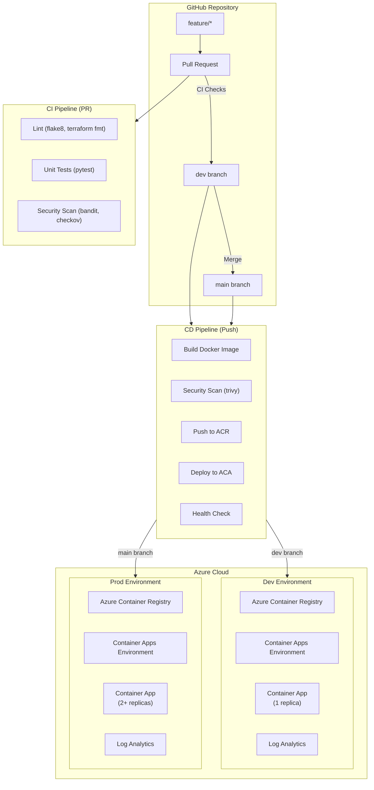

# Azure Container Apps DevOps Demo

[](https://github.com/AlanJ97/AzureContainerApps-DevOps-Demo/actions/workflows/terraform-ci.yaml)
[](https://github.com/AlanJ97/AzureContainerApps-DevOps-Demo/actions/workflows/terraform-cd.yaml)
[](https://github.com/AlanJ97/AzureContainerApps-DevOps-Demo/actions/workflows/app-ci.yaml)
[](https://github.com/AlanJ97/AzureContainerApps-DevOps-Demo/actions/workflows/app-cd.yaml)

> A complete DevOps lifecycle demonstration featuring **FastAPI**, **Terraform**, **Docker**, and **GitHub Actions** deployed to **Azure Container Apps**.

## 🌐 Live Demo

| Environment | URL | Status |
|-------------|-----|--------|
| **Dev** | [ca-aca-devops-demo-dev.reddesert-7aa50a55.eastus2.azurecontainerapps.io](https://ca-aca-devops-demo-dev.reddesert-7aa50a55.eastus2.azurecontainerapps.io) | ✅ Live |
| **Prod** | [ca-aca-devops-demo-prod.purpleforest-1c74a9e0.eastus2.azurecontainerapps.io](https://ca-aca-devops-demo-prod.purpleforest-1c74a9e0.eastus2.azurecontainerapps.io) | ✅ Live |

## 📋 Table of Contents

- [Architecture](#-architecture)
- [Tech Stack](#-tech-stack)
- [Project Structure](#-project-structure)
- [CI/CD Pipeline](#-cicd-pipeline)
- [Observability](#-observability)
- [Local Development](#-local-development)
- [Deployment](#-deployment)
- [API Endpoints](#-api-endpoints)
- [Security](#-security)
- [Lessons Learned](#-lessons-learned)

## 🏗️ Architecture



### Infrastructure Components

| Component | Purpose | Dev Config | Prod Config |
|-----------|---------|------------|-------------|
| **Resource Group** | Resource container | `rg-aca-devops-demo-dev` | `rg-aca-devops-demo-prod` |
| **Container Registry** | Docker image storage | Basic SKU | Standard SKU |
| **Container Apps Environment** | ACA hosting | Consumption | Workload Profiles |
| **Container App** | Application runtime | 0-2 replicas, 0.25 CPU | 2-10 replicas, 0.5 CPU |
| **Log Analytics** | Centralized logging | 30-day retention | 90-day retention |
| **Application Insights** | APM & telemetry | Workspace-based | Workspace-based |
| **Monitoring Dashboard** | Metrics visualization | 6 metric tiles | 6 metric tiles |
| **Alert Rules** | Automated notifications | 5 rules | 5 rules |

## 🛠️ Tech Stack

| Category | Technology |
|----------|------------|
| **Application** | Python 3.11, FastAPI, Uvicorn |
| **Containerization** | Docker (multi-stage build) |
| **Infrastructure** | Terraform 1.5+, Azure Container Apps |
| **CI/CD** | GitHub Actions |
| **Observability** | OpenTelemetry, Azure Monitor, Application Insights |
| **Security Scanning** | Bandit (Python), Checkov (IaC), Trivy (Container) |
| **Authentication** | Azure Service Principal (Contributor + User Access Administrator) |

## 📁 Project Structure

```
.
├── .github/
│   └── workflows/
│       ├── app-ci.yaml          # App linting, testing, security scan
│       ├── app-cd.yaml          # Build, push, deploy container
│       ├── terraform-ci.yaml    # Terraform fmt, validate, plan
│       └── terraform-cd.yaml    # Terraform apply
├── app/
│   ├── __init__.py
│   └── main.py                  # FastAPI application
├── terraform/
│   ├── modules/
│   │   └── aca_stack/           # Reusable infrastructure module
│   │       ├── main.tf
│   │       ├── variables.tf
│   │       └── outputs.tf
│   └── environments/
│       ├── dev/                 # Dev environment config
│       │   ├── main.tf
│       │   ├── backend.tf
│       │   └── terraform.tfvars
│       └── prod/                # Prod environment config
│           ├── main.tf
│           ├── backend.tf
│           └── terraform.tfvars
├── scripts/
│   ├── azure-service-principal.sh
│   ├── github-secrets.sh
│   ├── github-secrets-post-terraform.sh
│   └── README.md
├── tests/
│   └── test_main.py             # Unit tests
├── Dockerfile                   # Multi-stage Docker build
├── requirements.txt             # Production dependencies
├── requirements-dev.txt         # Development dependencies
└── pyproject.toml               # Python project config
```

## 🔄 CI/CD Pipeline

### Pipeline Overview

```
┌─────────────────────────────────────────────────────────────────────────────┐
│                              GITHUB ACTIONS                                  │
├─────────────────────────────────────────────────────────────────────────────┤
│                                                                             │
│  Pull Request → dev/main                    Push → dev/main                 │
│  ┌─────────────────────────┐                ┌─────────────────────────┐     │
│  │      APP CI             │                │      APP CD             │     │
│  │  ┌─────────────────┐    │                │  ┌─────────────────┐    │     │
│  │  │ Lint (flake8)   │    │                │  │ Build & Push    │    │     │
│  │  │ Test (pytest)   │    │                │  │ Security Scan   │    │     │
│  │  │ Security Scan   │    │                │  │ Deploy to ACA   │    │     │
│  │  └─────────────────┘    │                │  │ Health Check    │    │     │
│  └─────────────────────────┘                │  └─────────────────┘    │     │
│                                             └─────────────────────────┘     │
│  ┌─────────────────────────┐                ┌─────────────────────────┐     │
│  │    TERRAFORM CI         │                │    TERRAFORM CD         │     │
│  │  ┌─────────────────┐    │                │  ┌─────────────────┐    │     │
│  │  │ Format Check    │    │                │  │ Terraform Plan  │    │     │
│  │  │ Validate        │    │                │  │ Terraform Apply │    │     │
│  │  │ Security Scan   │    │                │  └─────────────────┘    │     │
│  │  │ Plan Preview    │    │                └─────────────────────────┘     │
│  │  └─────────────────┘    │                                                │
│  └─────────────────────────┘                                                │
│                                                                             │
└─────────────────────────────────────────────────────────────────────────────┘
```

### Workflow Triggers

| Workflow | Trigger | Path Filter | Environment |
|----------|---------|-------------|-------------|
| **App CI** | Pull Request | `app/**`, `Dockerfile`, `requirements*.txt` | - |
| **App CD** | Push to dev/main | `app/**`, `Dockerfile`, `requirements*.txt` | dev/prod |
| **Terraform CI** | Pull Request | `terraform/**` | - |
| **Terraform CD** | Push to dev/main | `terraform/**` | dev/prod |

### Branch Strategy (GitHub Flow)

```
feature/* ──PR──▶ dev ──PR──▶ main
                   │           │
                   ▼           ▼
               Deploy       Deploy
               to Dev      to Prod
```

## � Observability

### OpenTelemetry Integration

The application is instrumented with **OpenTelemetry** for comprehensive observability:

- **Automatic Instrumentation**: FastAPI requests, responses, and errors
- **Custom Metrics**:
  - `items_created` - Counter for created items
  - `items_deleted` - Counter for deleted items  
  - `item_name_length` - Histogram of item name lengths
  - `items_in_db` - UpDownCounter tracking database size

### Monitoring Resources

| Resource | Purpose |
|----------|----------|
| **Application Insights** | Centralized APM and telemetry collection |
| **Azure Portal Dashboard** | Real-time metrics visualization (HTTP requests, CPU, memory, replicas) |
| **Alert Rules** | Automated email notifications for critical issues |

### Alert Configuration

| Alert | Condition | Action |
|-------|-----------|--------|
| CPU Usage | > 80% for 5 minutes | Email notification |
| Memory Usage | > 80% for 5 minutes | Email notification |
| HTTP 5xx Errors | > 10 per minute | Email notification |
| Container Restarts | > 3 in 15 minutes | Email notification |
| Application Errors | Exceptions logged | Email notification |

### Access Monitoring

- **Live Metrics**: View real-time telemetry in Application Insights
- **Dashboard**: Access via Azure Portal → Dashboards → `dashboard-aca-devops-demo-{env}`
- **Logs**: Query traces and metrics in Log Analytics workspace

## �💻 Local Development

### Prerequisites

- Python 3.11+
- Docker Desktop
- Azure CLI
- Terraform 1.5+
- Git

### Setup

```bash
# Clone the repository
git clone https://github.com/AlanJ97/AzureContainerApps-DevOps-Demo.git
cd AzureContainerApps-DevOps-Demo

# Create virtual environment
python -m venv venv
source venv/bin/activate  # Linux/Mac
# or
.\venv\Scripts\Activate   # Windows

# Install dependencies
pip install -r requirements-dev.txt

# Run the application
uvicorn app.main:app --reload --port 8000
```

### Run with Docker

```bash
# Build the image
docker build -t fastapi-demo .

# Run the container
docker run -p 8000:8000 -e ENVIRONMENT=local fastapi-demo
```

### Run Tests

```bash
# Run unit tests
pytest tests/ -v

# Run with coverage
pytest tests/ --cov=app --cov-report=html
```

## 🚀 Deployment

### Initial Setup (One-time)

1. **Create Service Principal**
   ```bash
   # Run the script (requires Azure CLI login)
   ./scripts/azure-service-principal.sh
   ```

2. **Configure GitHub Secrets**
   ```bash
   # Set Azure credentials in GitHub
   ./scripts/github-secrets.sh
   ```

3. **Create Terraform State Storage**
   ```bash
   az storage account create \
     --name stterraformacademo \
     --resource-group rg-terraform-state \
     --location eastus2 \
     --sku Standard_LRS
   ```

4. **Run Terraform CD** - Push to `dev` branch to trigger infrastructure deployment

5. **Set Post-Terraform Secrets**
   ```bash
   # After Terraform creates resources
   ./scripts/github-secrets-post-terraform.sh
   ```

### Deploy Application

Push changes to the `dev` branch:

```bash
git checkout dev
git add .
git commit -m "feat: your changes"
git push origin dev
```

The App CD workflow will automatically:
1. Build the Docker image
2. Push to Azure Container Registry
3. Deploy to Azure Container Apps
4. Run health checks

## 📡 API Endpoints

| Endpoint | Method | Description | Response |
|----------|--------|-------------|----------|
| `/` | GET | Welcome message | `{"message": "Welcome to aca-devops-demo!"}` |
| `/health` | GET | Health check | `{"status": "healthy", "timestamp": "..."}` |
| `/health/live` | GET | Liveness probe | `{"status": "alive"}` |
| `/health/ready` | GET | Readiness probe | `{"status": "ready"}` |
| `/info` | GET | Application info | `{"app": "...", "version": "...", "environment": "..."}` |
| `/docs` | GET | OpenAPI documentation | Swagger UI |

## 🔒 Security

### Authentication Methods

| Component | Authentication |
|-----------|----------------|
| GitHub → Azure | Service Principal (Client ID + Secret) |
| ACA → ACR | `az acr login` (SP credentials, no admin) |
| Terraform State | Azure Storage Account Key |

### Security Scanning

| Stage | Tool | Purpose |
|-------|------|---------|
| CI | **flake8** | Python linting |
| CI | **bandit** | Python security vulnerabilities |
| CI | **checkov** | Terraform misconfigurations |
| CD | **trivy** | Container image CVEs |

### Best Practices Implemented

- ✅ No hardcoded secrets (all in GitHub Secrets)
- ✅ Service Principal with least privilege
- ✅ HTTPS enforced (`allowInsecure: false`)
- ✅ Multi-stage Docker build (minimal attack surface)
- ✅ Non-root container user
- ✅ Image tagged with commit SHA (never `latest`)

## 📚 Lessons Learned

### 1. PowerShell UTF-8 BOM Issue

**Problem:** PowerShell pipes add UTF-8 BOM (`EF BB BF`) to strings, corrupting GitHub secrets.

**Symptom:** Azure login fails with `AADSTS900023: Specified tenant identifier is not valid`

**Solution:** Use `--body` flag instead of piping:
```bash
# ❌ Bad - adds BOM
echo $value | gh secret set NAME

# ✅ Good - no BOM
gh secret set NAME --body "$value"
```

### 2. GitHub Actions Secret Masking in Outputs

**Problem:** Job outputs containing secret values are automatically blocked by GitHub.

**Symptom:** Downstream jobs receive empty strings for outputs.

**Solution:** Construct values in the consuming job instead of passing as output:
```yaml
# ❌ Bad - output gets masked
outputs:
  full_image: ${{ steps.build.outputs.image }}

# ✅ Good - construct in the job that needs it
run: |
  IMAGE="${{ secrets.ACR_NAME }}.azurecr.io/app:${{ needs.setup.outputs.tag }}"
```

### 3. Azure Provider Registration

**Problem:** `Microsoft.App` namespace not registered in subscription.

**Solution:** Register before Terraform apply:
```bash
az provider register --namespace Microsoft.App
```

### 4. Role Assignments in Terraform

**Problem:** Service Principal needs `User Access Administrator` role to create role assignments.

**Solution:** Add role to SP:
```bash
az role assignment create \
  --assignee <SP_OBJECT_ID> \
  --role "User Access Administrator" \
  --scope /subscriptions/<SUB_ID>
```

## 📄 License

MIT License - See [LICENSE](LICENSE) for details.

## 🤝 Contributing

1. Fork the repository
2. Create a feature branch (`git checkout -b feature/amazing-feature`)
3. Commit your changes (`git commit -m 'feat: add amazing feature'`)
4. Push to the branch (`git push origin feature/amazing-feature`)
5. Open a Pull Request

---

Built with ❤️ for demonstrating modern DevOps practices on Azure.
